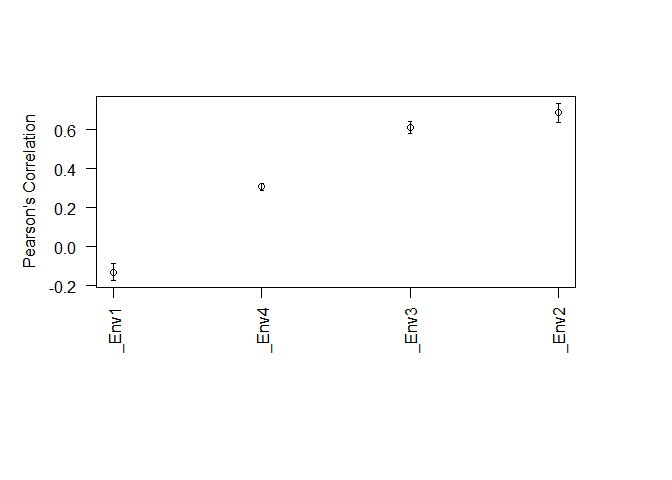
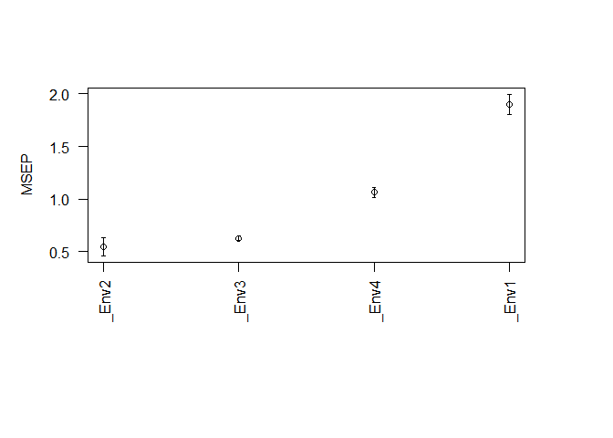
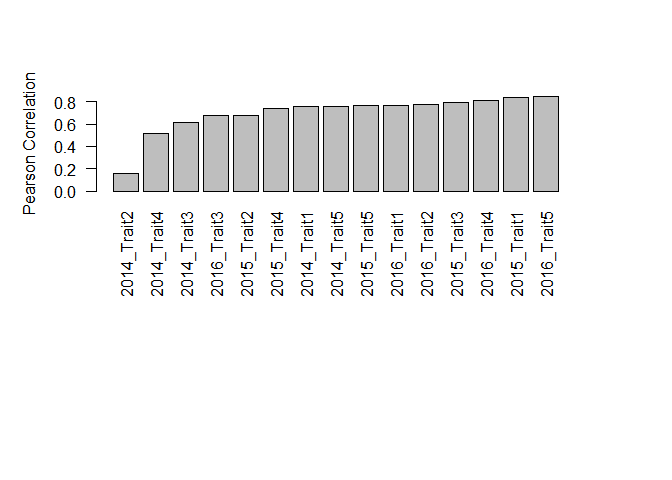
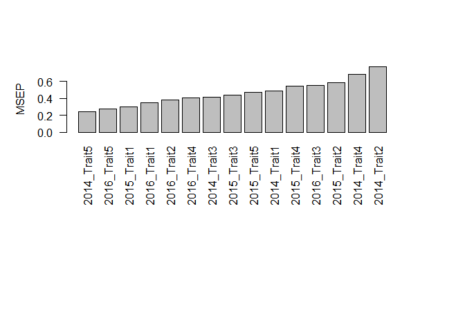

<p align="center">

<a href="https://github.com/frahik/GFR">
 </a>

<h4 align="center">

**I**tem **B**ased **C**ollaborative **F**ilterign For
**M**ulti-**T**rait and **M**ulti-**E**nvironment Data in R -
Development version 1.2 - rev 5.

</h4>

<h4 align="center">

\[Last README update: 2018-03-03\]

</h4>

<p align="center">

[](https://cran.r-project.org/package=IBCF.MTME "CRAN Page")
[](https://www.gnu.org/licenses/lgpl-3.0 "LGPL, Version 2.0")
[](http://www.repostatus.org/#active "status - active")
[](https://cran.r-project.org/package=IBCF.MTME "CRAN Page")

</p>

</p>

# Table of contents

  - [NEWS](#news)
  - [instructions](#instructions)
      - [Installation](#install)
      - [Load the package](#package)
      - [Example of Cross-validation with IBCF.MTME and external
        data](#example1)
          - [Load external data](#external-data)
          - [Generate a data set in tidy data](#generate-tidydata)
          - [Generate a Cross-validation](#generate-crossvalidation)
          - [Fitting the predictive model](#fit-model)
          - [Show some results](#results)
      - [Example of Years prediction with IBCF.Years
        Function](#example2)
          - [Loading your data](#external-data2)
          - [Transforming the data from Tidy data to matrix
            form](#generate-matrixform)
          - [Adjust the model](#adjust-model)
          - [Show some results](#results)
      - [Load available data from the package](#load-data)
  - [How to cite this package](#cite)
  - [Contributions](#contributions)
  - [Authors](#authors)

<h2 id="news">

News of this version (1.2)

</h2>

  - Fixed important issue from `IBCF()$predictions_Summary`, now the
    correlation only uses the predicted testing data.
  - Now `IBCF()` function show `$yHat` that is an average of the
    prediction values of every partition.
  - Now `IBCF()` function shows in `$predicted_Partition` all the
    partitions values predicted (before was `$Predictions` and was
    changed to not confuse with `$yHat`).
  - Now `IBCF()` function shows in `$observed` all the response values
    from the DataSet.
  - Now `IBCF()` function shows in `$Data.Obs_Pred` all the response and
    predicted values from the DataSet.
  - Now `IBCF.Years()` function shows in `$predicted` all the values
    predicted.
  - Now `IBCF.Years()` function shows in `$observed` the response values
    for all the years from the Traits selected in `Traits.testing`.
  - Now `CV.RandomPart()` shows the lenght in every partition in
    `$CrossValidation_length`.
  - Now `CV.RandomPart()` admits `Traits.testing` to only use a
    `PTesting` percentage defined of the traits specified in the
    parameter to be used to fit the model.

See the last updates in [NEWS](NEWS.md).

<h2 id="instructions">

Instructions for proper implementation

</h2>

<h3 id="install">

Installation

</h3>

To complete installation of dev version of IBCF.MTME from GitHub, you
must have previously installed the devtools package.

``` r
install.packages('devtools')
devtools::install_github('frahik/IBCF.MTME')
```

<h3 id="package">

Load the package

</h3>

``` r
library(IBCF.MTME)
```

<h3 id="example1">

Example of Cross-validation with IBCF.MTME

</h3>

<h4 id="external-data">

Load available data from other package

</h4>

``` r
library(BGLR)
data(wheat)
```

<h4 id="generate-tidydata">

Generate a new data set in tidy data form

</h4>

``` r
pheno <- data.frame(ID = gl(n = 599, k = 1, length = 599*4),
                    Response = as.vector(wheat.Y),
                    Env = paste0('Env', gl(n = 4, k = 599)))

head(pheno)
```

    ##   ID   Response  Env
    ## 1  1  1.6716295 Env1
    ## 2  2 -0.2527028 Env1
    ## 3  3  0.3418151 Env1
    ## 4  4  0.7854395 Env1
    ## 5  5  0.9983176 Env1
    ## 6  6  2.3360969 Env1

<h4 id="generate-crossvalidation">

Generate 10 partitions to do
cross-validation

</h4>

``` r
CrossV <- CV.RandomPart(pheno, NPartitions = 10, PTesting = 0.25, Set_seed = 123)
```

<h4 id="fit-model">

Fitting the predictive model

</h4>

``` r
pm <- IBCF(CrossV)
```

<h4 id="results">

Show some results

</h4>

``` r
summary(pm)
```

    ##   Trait_Env Pearson SE_Cor   MSEP SE_MSEP
    ## 1     _Env1 -0.1307 0.0230 1.9010  0.0452
    ## 2     _Env2  0.6859 0.0092 0.5454  0.0118
    ## 3     _Env3  0.6116 0.0164 0.6284  0.0234
    ## 4     _Env4  0.3068 0.0257 1.0640  0.0495

``` r
par(mai = c(2, 1, 1, 1))
plot(pm, select = 'Pearson')
```

<!-- -->

``` r
plot(pm, select = 'MSEP')
```

<!-- -->

<h3 id="example2">

Example of Years prediction with IBCF.Years Function

</h3>

<h4 id="external-data2">

Loading your data

</h4>

``` r
load('DataExample.RData')
head(Data.Example)
```

    ##   Years Gids  Trait Response
    ## 1  2014    1 Trait1 15.14401
    ## 2  2014    2 Trait1 15.67879
    ## 3  2014    3 Trait1 14.85489
    ## 4  2014    4 Trait1 13.57002
    ## 5  2014    5 Trait1 15.01838
    ## 6  2014    6 Trait1 13.19616

<h4 id="generate-matrixform">

Transforming the data from Tidy data to matrix form

</h4>

``` r
Data.Example <- getMatrixForm(Data.Example, onlyTrait = TRUE)
head(Data.Example)
```

    ##   Years Gids   Trait1  Trait10  Trait11  Trait12   Trait2   Trait3
    ## 1  2014    1 15.14401 18.51428 17.08970 19.16776 16.21435 17.53858
    ## 2  2014    2 15.67879 18.21569 17.89645 19.94429 15.80614 17.89946
    ## 3  2014    3 14.85489 17.72576 15.78198 17.53058 14.06164 16.11997
    ## 4  2014    4 13.57002 18.57009 15.73343 17.49995 14.58312 15.22495
    ## 5  2014    5 15.01838 18.57348 16.97414 19.03081 14.98192 15.65125
    ## 6  2014    6 13.19616 16.83588 15.12312 17.39867 15.81264 14.80517
    ##     Trait4   Trait5   Trait6   Trait7   Trait8   Trait9
    ## 1 15.51840 17.59132 17.14852 17.04474 17.48970 18.36118
    ## 2 15.13337 18.36446 17.32734 17.46764 18.08501 18.67266
    ## 3 15.04329 17.28942 16.50978 16.26685 17.02774 17.05612
    ## 4 14.93028 16.33687 15.11493 15.06632 17.56798 16.48810
    ## 5 16.70963 16.81113 17.24170 15.53379 16.07600 16.54047
    ## 6 14.82150 16.49238 15.37325 14.07796 15.98419 15.84705

<h4 id="adjust-model">

Adjust the
model

</h4>

``` r
pm <- IBCF.Years(Data.Example, colYears = 1, Years.testing = c('2014', '2015', '2016'), Traits.testing = c('Trait1', 'Trait2', 'Trait3', 'Trait4', "Trait5"))
```

<h4 id="results2">

Show some results

</h4>

``` r
summary(pm)
```

    ##              Year_Trait Pearson   MSEP
    ## 2014_Trait1 2014_Trait1  0.7549 0.4836
    ## 2014_Trait2 2014_Trait2  0.1562 0.7769
    ## 2014_Trait3 2014_Trait3  0.6130 0.4164
    ## 2014_Trait4 2014_Trait4  0.5208 0.6821
    ## 2014_Trait5 2014_Trait5  0.7587 0.2408
    ## 2015_Trait1 2015_Trait1  0.8432 0.2987
    ## 2015_Trait2 2015_Trait2  0.6792 0.5828
    ## 2015_Trait3 2015_Trait3  0.7944 0.4416
    ## 2015_Trait4 2015_Trait4  0.7394 0.5425
    ## 2015_Trait5 2015_Trait5  0.7650 0.4739
    ## 2016_Trait1 2016_Trait1  0.7690 0.3517
    ## 2016_Trait2 2016_Trait2  0.7753 0.3818
    ## 2016_Trait3 2016_Trait3  0.6763 0.5527
    ## 2016_Trait4 2016_Trait4  0.8157 0.4076
    ## 2016_Trait5 2016_Trait5  0.8533 0.2779

``` r
par(mai = c(3, 1, 1, 1))
barplot(pm, las = 2)
```

<!-- -->

``` r
barplot(pm, select = 'MSEP', las = 2)
```

<!-- -->

<h4 id="load-data">

Load available data from the package

</h4>

You can use the data sets in the package to test the functions

``` r
library(IBCF.MTME)
data('Wheat_IBCF')

head(Wheat_IBCF)
```

    ##       GID Trait    Env   Response
    ## 1 6569128    DH Bed2IR -17.565895
    ## 2 6688880    DH Bed2IR  -4.565895
    ## 3 6688916    DH Bed2IR  -3.565895
    ## 4 6688933    DH Bed2IR  -4.565895
    ## 5 6688934    DH Bed2IR  -7.565895
    ## 6 6688949    DH Bed2IR  -7.565895

``` r
data('Year_IBCF')

head(Year_IBCF)
```

    ##   Years Gids Trait Response
    ## 1  2014    1    T1 5.144009
    ## 2  2014    2    T1 5.678792
    ## 3  2014    3    T1 4.854895
    ## 4  2014    4    T1 3.570019
    ## 5  2014    5    T1 5.018380
    ## 6  2014    6    T1 3.196160

<h2 id="cite">

Citation

</h2>

First option, by the article paper

(Comming soon)

Second option, by the manual package

``` r
citation('IBCF.MTME')
```

    ## 
    ## To cite package 'IBCF.MTME' in publications use:
    ## 
    ##   Francisco Javier Luna-Vazquez, Osval Antonio Montesinos-Lopez,
    ##   Abelardo Montesinos-Lopez and Jose Crossa (2018). IBCF.MTME:
    ##   Item Based Collaborative Filtering for Multi-Trait and
    ##   Multi-Environment Data. R package version 1.2-5.
    ##   https://CRAN.R-project.org/package=IBCF.MTME
    ## 
    ## A BibTeX entry for LaTeX users is
    ## 
    ##   @Manual{,
    ##     title = {IBCF.MTME: Item Based Collaborative Filtering for Multi-Trait and
    ## Multi-Environment Data},
    ##     author = {Francisco Javier Luna-Vazquez and Osval Antonio Montesinos-Lopez and Abelardo Montesinos-Lopez and Jose Crossa},
    ##     year = {2018},
    ##     note = {R package version 1.2-5},
    ##     url = {https://CRAN.R-project.org/package=IBCF.MTME},
    ##   }

<h2 id="contributions">

Contributions

</h2>

If you have any suggestions or feedback, I would love to hear about it.
Feel free to report new issues in [this
link](https://github.com/frahik/IBCF.MTME/issues/new), also if you want
to request a feature/report a bug, or make a pull request if you can
contribute.

<h2 id="authors">

Authors

</h2>

  - Francisco Javier Luna-Vázquez (Author, Maintainer)
  - Osval Antonio Montesinos-López (Author)
  - Abelardo Montesinos-López (Author)
  - José Crossa (Author)
